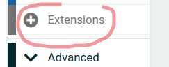
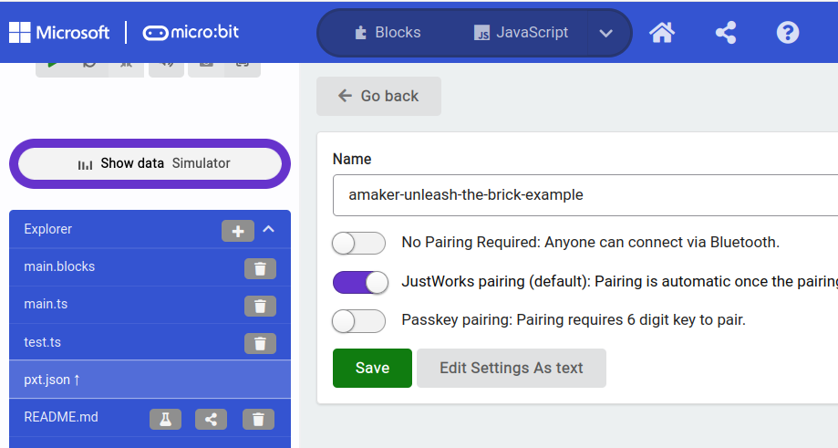
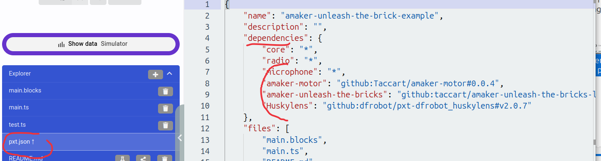
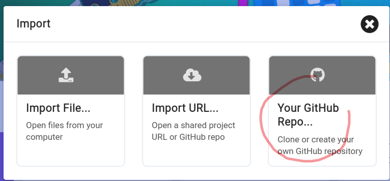
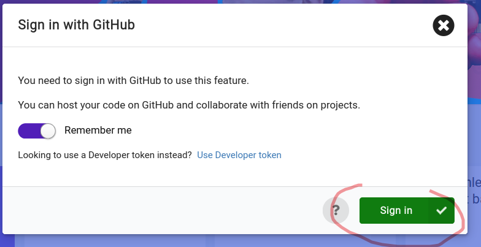
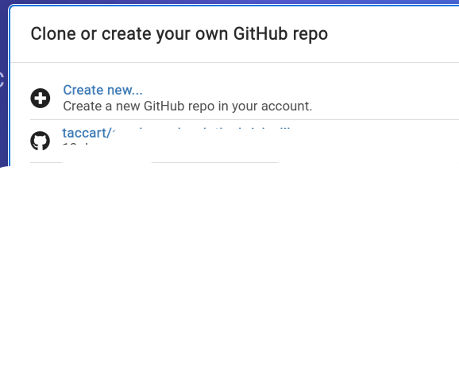
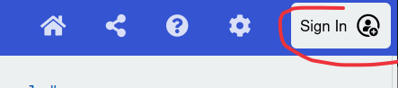
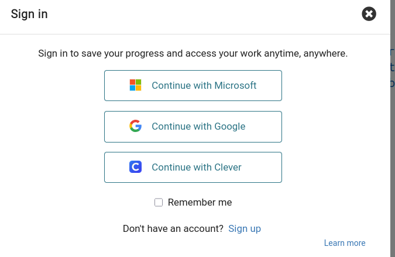
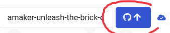

# Load demo code
Using this project as base project for your participation:
1. open [makecode.microbit.org](https://makecode.microbit.org/) in your chrome/edge/chromium browser (Firefox is possible but does not allow direct upload of code from browser)
   [amaker-unleash-the-brick-example](https://github.com/Taccart/amaker-unleash-the-brick-example)
   
   click on import button
2. Choose import URL in the import screen 
3. Set [https://github.com/Taccart/amaker-unleash-the-brick-example](https://github.com/Taccart/amaker-unleash-the-brick-example) as URL to import
   
4. You should have pre-installed the amaker libraries:
   * [amaker-motor](https://github.com/Taccart/amaker-motor)
   * [UnleashTheBricks](https://github.com/Taccart/amaker-unleash-the-bricks-lib)
   * [HuskyLens](https://github.com/DFRobot/pxt-DFRobot_HuskyLens)
   

# Pre-loaded extensions:
## [UnleashTheBricks](https://github.com/Taccart/amaker-unleash-the-bricks-lib)
Extension dedicated to Unleash The Bricks tournament : it handles the communication with controller.
You have to add your own code in the given events (start / stop / danger ).
* [amaker-motor](https://github.com/Taccart/amaker-motor)
This extension gives an easy way to control your continuous servo motors or positional servo motors.
The servo number corresponds to the connector where the servo is plugged on.
* [HuskyLens](https://github.com/DFRobot/pxt-DFRobot_HuskyLens)
This extension handles interactions between your micro:bit and the Huskylens module.
Check [Overview of module](https://wiki.dfrobot.com/HUSKYLENS_V1.0_SKU_SEN0305_SEN0336)
and [pxt-DFRobot_HuskyLens](https://github.com/DFRobot/pxt-DFRobot_HuskyLens?tab=readme-ov-file)
# Using MakeCode
## Add & remove extension
Libraries are called `extensions`
**You shall save your code before managing extension**
sometimes a buggy library can block your code to load.
### Add extension
1.open `extensions` via top button

of by micro:bit code button

2.then provide the github repo (for private repos),

or by name (for libraries integrated to microsoft pxt.)

### Remove extension, changing its version
To manage versions and deletion of extension you have to remove it from pxt.json:
switch to code view (python or javascript)
click on pxt.json in files, pass the connection screen 
and edit the `dependencies` (remove line or change defined version.) 
edit

## Save/Load your code to/from your own github repo
### Load from your repo
Click on the import button (see above) and choose Your GitHub Repo

Sign in

Choose the repo be imported (or create one)

### Save to your repo
Sign in GitHub

Sign in confirmed

Use the GitHub send button
